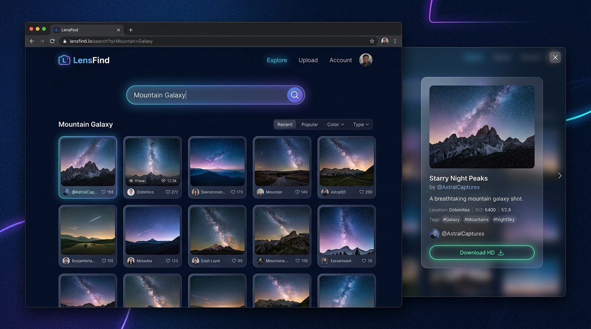

<div align="center">

# 🖼️ Image Search App

### A Fast, Responsive Image Discovery Engine with HD Modal Preview & 1-Click Download

<p align="center">
  <a href="https://atulkumar5772.github.io/Image-Search-App/" target="_blank">
    
  </a>
  <a href="LICENSE">
    
  </a>
  
  
</p>

<br/>

<a href="https://atulkumar5772.github.io/Image-Search-App/" target="_blank">
  
</a>

</div>

---

## 📌 Project Overview

The **Image Search App** is an asynchronous, API-driven web application developed during my **1st Year Internship Program**. The goal was to build a clean, real-world frontend tool that communicates with external RESTful endpoints to fetch, display, and interact with high-resolution digital media seamlessly.

The application allows users to query millions of curated photographs from the **Unsplash API**, preview high-definition images in an interactive lightbox tile, and download assets directly to their local machine with a single click.

---

## ✨ Key Features

- 🔍 **Real-Time Search & Fetch:** Instant queries with smooth asynchronous `fetch()` API calls.
- 🖼️ **Interactive HD Modal Preview:** Click any thumbnail to expand it into a high-resolution lightbox with photographer attribution.
- ⬇️ **One-Click Direct Download:** Downloads the actual image file (`.jpg`) directly to your system with feedback indicators.
- 🎨 **Modern Dark Glassmorphism UI:** Built with radial dark gradients, responsive grid layouts, and fluid hover zoom effects.
- 🔐 **Secure Configuration Architecture:** Decoupled API credentials using `config.js` and `.gitignore` to prevent sensitive key exposure.
- 📱 **100% Responsive Design:** Smooth experience across Mobile, Tablet, and Desktop screens.

---

## 🛠️ Technology Stack

<div align="center">

| Category | Technologies | Description |
| :--- | :--- | :--- |
| **Frontend** | HTML5 • Modern CSS3 • JavaScript (ES6+) | Semantic markup, responsive styling, and DOM handling |
| **API Provider** | Unsplash Developers REST API | High-resolution photography database |
| **Styling & UI** | Glassmorphism & FontAwesome | Dark gradients, modal backdrop filters & UI icons |
| **Version Control** | Git & GitHub | Distributed version control & source code management |
| **Hosting & Deployment** | GitHub Pages | Continuous automated deployment |

</div>

---

## 📂 Project Structure

```text
Image-Search-App/
├── assets/
│   └── preview.png      # Application screenshot & mockup banner
├── index.html           # Main markup & modal layout
├── style.css            # Dark mode styling & responsive grid
├── script.js            # Asynchronous search, modal & download logic
├── config.js            # Local API configuration (git-ignored)
├── config.example.js    # Public configuration template
├── .gitignore           # Security filter for keys & private assets
├── LICENSE              # MIT License
└── README.md            # Comprehensive project documentation
```

---

## 🎯 Internship Learning Outcomes

Building this project during my 1st Year Internship helped me master:
- **Asynchronous JavaScript:** Handling REST APIs using `fetch()`, `async/await`, Promises, and error boundaries.
- **Binary Data Handling:** Generating dynamic `Blob` objects and Object URLs for client-side file downloads.
- **Dynamic DOM Engineering:** Creating components and event listeners on the fly without heavy frontend frameworks.
- **Frontend Security Best Practices:** Managing environment secrets and separating configuration from public code.

---

## 🌐 Live Demo

🔗 **Live Website:** [https://atulkumar5772.github.io/Image-Search-App/](https://atulkumar5772.github.io/Image-Search-App/)

🔗 **GitHub Repository:** [https://github.com/Atulkumar5772/Image-Search-App](https://github.com/Atulkumar5772/Image-Search-App)

---

## 🚀 Setup & Local Execution

1. **Clone the repository:**
   ```bash
   git clone https://github.com/Atulkumar5772/Image-Search-App.git
   cd Image-Search-App
   ```

2. **Configure your API Key:**
   - Rename `config.example.js` to `config.js`
   - Insert your free Unsplash Access Key from [Unsplash Developer Portal](https://unsplash.com/developers):
     ```javascript
     window.CONFIG = {
       UNSPLASH_ACCESS_KEY: 'YOUR_UNSPLASH_KEY'
     };
     ```

3. **Launch the App:**
   - Simply double click `index.html` or use Live Server in VS Code.

---

## 🔮 Future Roadmap

- [ ] Infinite scroll / Pagination for deeper search exploration
- [ ] Category filter chips (e.g., Nature, Technology, Architecture)
- [ ] Resolution selector before download (Standard, High, Ultra 4K)
- [ ] Favorite images bookmarking via `localStorage`

---

## 📄 License

This project is licensed under the **MIT License**. See the [LICENSE](LICENSE) file for more details.

---

## 👨‍💻 Author

<div align="center">

### Atul Kumar
**Computer Science Student @ PIET • Red Hat Intern • Salesforce Developer**

<p align="center">
  <a href="https://github.com/Atulkumar5772" target="_blank">
    
  </a>
  &nbsp;
  <a href="https://www.linkedin.com/in/atul-kumar-454b34380/" target="_blank">
    
  </a>
  &nbsp;
  <a href="mailto:atulchoudhary181005@gmail.com">
    
  </a>
  &nbsp;
  <a href="https://leetcode.com/u/atulkumar181005/" target="_blank">
    
  </a>
</p>

</div>

---

<div align="center">

⭐ **If you find this project helpful or interesting, please consider starring the repository!**

</div>
